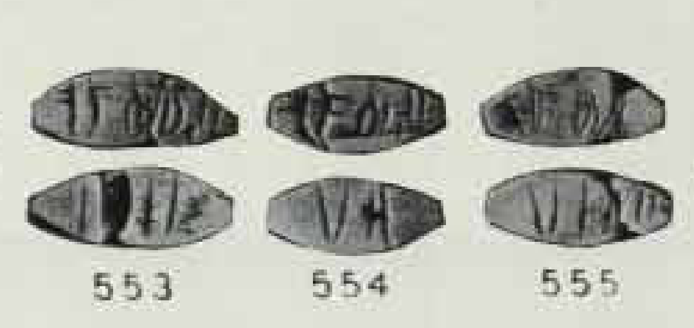

# A paired-face constraint on numerical readings of the Indus script

**Research date:** 5 September 2026  
**Repository:** Cuuper22/ivc  
**Status:** reproduced structural observation, complete filtered witness census, and conditional numerical-model audit. Not a decipherment or an accepted lexical reading.

## Result and scholarly priority

Four different front-side inscriptions in the Mahadevan concordance each occur with a cup sign plus two, three, and four long strokes on the other face. The twelve combinations cover 34 catalogued objects. Across the full eligible set, eight front-text families have variable reverse-side stroke counts.

**The basic fixed-front/variable-reverse observation is not new.** Priyanka's 2003 article discusses this pattern, and Mukhopadhyay's 2023 study explicitly describes the same obverse occurring with all three reverse constructions [5–6]. The latter proposes differentiated functions for the two faces. Neither that specific semantic interpretation nor a competing interpretation is established by this audit.

The contribution of this run is the recovered and frozen scholarly corpus, explicit inclusion/exclusion rules, an exhaustive census within those rules, source-linked minimal counterexamples, and exact finite-data failure bounds for deterministic front-only models. The exact package and characterization are new to this repository; priority for the formalization has not been established. Linked-face analysis itself is not claimed as a new scholarly method.

The constraint is straightforward: a fixed front cannot always be an alternative notation for the same scalar quantity as its reverse, if the reverse strokes have a fixed positive unit value. Changing a number base cannot fix that contradiction. A working model with a fixed descriptor and a separately variable parameter is compatible with the observations, but "descriptor" is a proposed function, not a translated word or a newly discovered interpretation. The finite grid does not establish statistical independence.

## 1. Recovering the scholarly comparison corpus

The inspected repository relied on a Lipi planning corpus and smaller comparison layers. Its July checkpoint also narrowed the previously accepted terminal-tail observation; the root README's stronger wording was not treated as the current evidence standard.

The public Mahadevan concordance used by the Indus Research Centre / RMRL's `indusscript.in` Browse interface was retrieved through its ordinary public collection, without accounts or authentication bypass. Fourteen response pages exhausted pagination. This is a preserved source snapshot, not a new transcription made by this project.

| Completeness check | Retrieved snapshot | Mahadevan's published corpus |
|---|---:|---:|
| Catalogued objects | 2,906 | 2,906 |
| Nonempty inscription lines | 3,573 | 3,573 |
| Legible sign occurrences, including doubtful readings | 13,372 | 13,372 |
| Sign inventory, including doubtful readings | 417 | 417 |
| Sign 342 occurrences, including doubtful readings | 1,395 | 1,395 |
| Sign 99 occurrences, including doubtful readings | 649 | 649 |

There are 3,916 database records because another 343 records describe surfaces with no text. These are not 3,916 independent inscriptions. The checks agree with the original 1977 book's corpus accounting, especially sections 4–5, 9.2, and its sign-frequency tables. Census agreement does not prove every individual reading correct.

Combined raw JSON SHA-256:

```
6a0c597986783c5da8fbcb0afc3268a2c6a9f042a9b81746ebc4f89158efbd01
```

This is an independent transcription system, **not an independent archaeological sample**: many objects also occur in the other catalogues. The snapshot reproduces the base corpus, not the expanded addendum totals mentioned in the resource announcement [4]. The linked web manual PDFs returned HTTP 404, recorded in the acquisition manifest. Codebook interpretation instead used the original Mahadevan book already preserved in the repository and the public application's conventions.

## 2. Inclusion rules

All fourteen original sign slots and metadata are retained. `0` means an illegible or lost passage, not the number zero. A leading asterisk marks a doubtful reading. Blank trailing slots are padding. Doubtful readings contribute to the published-census comparison but never become undoubted signs in the strict analysis. No sign classes or possible allographs were merged.

The strict subset requires a nonempty line, direction code 1/2/3, undoubted IDs 1–417, no damage marker, no internal blank slot, and agreement between the slot count and the recorded position and legible-sign counts. It contains **2,575 lines**, or **1,659 distinct exact strings with 7,409 tokens**. "Strict" means unflagged under these catalogue rules, not newly certified undamaged photographs.

Paired-face analysis additionally requires exactly two recorded surfaces of one object, each with one line (`sideline` 10 and 20), both strict, and object class 3, the miniature-tablet class. Exactly one face must be cup sign 328 paired with a selected long-stroke group. Different objects are never joined merely because their texts resemble each other.

Publisher illustrations show one through five long strokes for signs 86, 87, 89, 95, and 96 respectively. These are visual counts; their numerical or metrological semantics remain hypotheses. Short-stacked sign 103 is distinct. Although one- and five-stroke groups were eligible, only two, three, and four occur in the resulting paired subset: 19, 35, and 31 objects respectively.

The result is **85 paired objects and 39 distinct front strings**. "Front" means the face other than the cup-and-strokes face, not an assertion about ancient obverse/reverse conventions. Display order is the reverse of stored slots for comparability with the repository's display convention. Both orders are preserved; this operation establishes no phonetic reading direction.

## 3. Four-by-three witness grid

All identifiers below are **Mahadevan 1977 text numbers**, not CISI artifact numbers. Sign IDs likewise use Mahadevan's namespace. One representative object is shown per cell; the JSON supplies every witness.

| Fixed front inscription | Cup + 2 long strokes | Cup + 3 long strokes | Cup + 4 long strokes | All objects in family |
|---|---|---|---|---:|
| 176–342–48 | text 4548 | text 4403 | text 4508 | 21 |
| 211–72 | text 4551 | text 5496 | text 4428 | 3 |
| 342–403–103 | text 4554 | text 4512 | text 4553 | 6 |
| 402–287 | text 5410 | text 4502 | text 5418 | 4 |

These are 12 occupied cells covering 34 catalogued objects. Four additional front families have two different reverse counts, making eight variable families in total. Deduplicating entire front-plus-reverse combinations leaves **51 distinct pairs across 39 front strings**.

An arbitrary lookup table that memorizes every front can assign only one reverse count per front. It therefore fits at most **39 of 51 distinct pairs**. Weighting by catalogued objects, the best possible lookup fits **63 of 85**, necessarily missing **22**. These are exact finite-data bounds, not held-out accuracy estimates or population claims. They follow by choosing the largest reverse-count group for every front in `front_families.json`; `deterministic_lookup_bound.json` records the result.

## 4. Conditional counterexample

Let F be the value assigned to an unchanged front expression. Assume:

1. Its complete encoded string corresponds to the same expression and value on the compared objects.
2. A reverse with n long strokes represents n times a fixed positive unit u.
3. The two faces express the same scalar quantity.

Texts 4554 and 4553 then require both

```
F = 2u
F = 4u
```

Subtracting gives `2u = 0`, contradicting `u > 0`. The argument applies to every variable-count family. It does not depend on a guessed front-sign value, a base of eight versus ten, or a particular parsing of the front. More generally, it holds whenever a fixed reverse-value function assigns different values to the observed reverse groups.

**At least one assumption fails.** Possibilities include a front descriptor rather than a total, context-dependent units, non-numerical strokes, omitted contextual information, or catalogue normalization conflating genuinely different signs. Object-specific units can avoid the contradiction, but then a reading needs independently motivated rules for that variation rather than a fixed front-only conversion.

This constrains a model class; it does not identify the correct interpretation. It also does not refute every restricted numerical equation for a separately justified subgroup of tablets. It must not be reported as wholesale refutation of Fuls's numerical work [3].

## 5. Original-source checks

The controlled subset of Mahadevan texts **4553, 4554, and 4555** has encoded front 342–403–103 and reverse stroke counts four, two, and four. Both faces share the recorded object class, direction, locus code 42, level −15, and field-symbol code. These are useful metadata controls, not proof of a common production event or identical measurement units.

Mahadevan's original text table lists this contrast. Its source-number appendix connects the 4xxx series to Vats's numbered illustrations. The repository's scan of **M. S. Vats, _Excavations at Harappa_, volume II, plate XCVII**, was retrieved and objects **553, 554, and 555** inspected directly. The plate is PDF page index 201. The archive metadata labels the item volume I, whereas this source is the plate volume.



The plate corroborates the paired objects and reverse-side contrast. Its low resolution does **not** independently settle every tiny front stroke or possible allograph: exact normalized front identity remains a catalogue-level proposition. The crop's source PDF hash, page, and rendering coordinates are preserved. Enlargement is not treated as recovering missing detail.

A second check links **CISI H-306** to Mahadevan text **5474** through excavation number **13270**, not merely through a learned sign mapping. Both catalogues record two long strokes on the non-cup face and three on the cup face; existing object photographs were inspected. Different face-specific units could explain this object in isolation, which is why the identical-front families are stronger constraints. No uncertain Mahadevan-to-CISI aliases for texts 4553–4555 were promoted.

## 6. Consequences for further interpretation

Numerical models should represent linked artifact faces as potentially complementary fields, not automatically equate their quantities. Any model using fixed units and equal face-values must address the complete counterexample set, not only selected matching examples. Future evaluation must keep entire objects and related exact formula families together.

A descriptor-plus-parameter model is compatible with the data, but cannot distinguish a name, institution, commodity, ritual category, license category, or other descriptor. The rival functional interpretations in earlier scholarship remain hypotheses. Nor does this recurrence pattern establish whether the whole sign system encodes spoken language.

High-resolution checking of the exact minimal-pair front signs is a specific remaining source test. It could strengthen the shared-expression premise or expose a meaningful graphical distinction.

## 7. Rejected exploratory routes

An initial Lipi six-cell substitution grid looked striking against simple position-preserving shuffles. A stronger exploratory suffix-swap control preserved adjacent-sign and position frequencies. Its global Monte Carlo tail frequency was approximately 0.095 before a suspected-allograph merger and 0.219 afterward. The samples were correlated MCMC draws without a certified mixing bound; no formal significance claim is made. That grid was not retained as breakthrough evidence.

An iconographic minimal-pair scan produced no sufficiently repeated one-sign replacement tied to a motif change. Exploratory cross-catalogue alignments were also not accepted: seed selection had seen the full data, invalidating a claim of independent test performance. These failed exploratory searches are distinct from the conditional paired-face proof, which does not depend on statistical surprise under an n-gram null.

## 8. Conditional arithmetic appendix

Fuls's numerical proposal supplies `v = 2S − L` and `vL + 1 = 7S + 5` under its artifact interpretations [3]. Exhaustive positive-integer solution is possible:

```
S(2L − 7) = L² + 4.
Let d = 2L − 7 > 0.
4S = d + 14 + 65/d.
```

Thus d divides 65. Its four positive divisors give exactly

```
(L, S, v) = (4,20,36), (6,8,10), (10,8,6), (36,20,4).
```

Adding the proposed bangle constraint `15 ≤ 7 + L ≤ 20` leaves `(10,8,6)`. This conditionally recovers a previously proposed assignment; it is not a new accepted numerical reading. Algebra does not validate equal-face assumptions, the reconstructed bangle count, or interpretation of the original numerical groups.

## 9. Reproduction and evidence status

From the repository root, Python 3.10+, no third-party packages:

```sh
python research/tools/mahadevan_constraint_audit.py \
  --input research/data/mahadevan_20260905/concordance_documents.json.gz \
  --output /tmp/ivc-mahadevan-audit
```

Before analysis, the code checks all six published census numbers, redundant transcription fields, consecutive record indices, and unique object/side/line keys. It preserves exclusions and source codes. Outputs include all paired objects, all front families, the complete grid, and conditional counterexample certificates. Finite lookup bounds follow from the supplied distributions by the formula above.

The frozen input, normalized CSV, acquisition manifest, source witnesses, and hashes are in `research/data/mahadevan_20260905/`. Nothing in the numerical analysis relies on OCR of the displayed crop. Twenty-five preserved-file hashes and eight regenerated core outputs were checked against the published packet locally.

**Ledger:** no accepted translation, phonetic value, sign meaning, language identification, or external anchor was added. The prior accepted structural count was not silently changed. This study supplies a reproducible audit and formal constraints built around a previously reported observation, not a claimed new decipherment.

## Sources

[1] Iravatham Mahadevan, _The Indus Script: Texts, Concordance and Tables_, Memoirs of the Archaeological Survey of India 77 (1977). Original source text is preserved under `evidence/tmp/cisi_xml/`; public concordance: https://indusscript.in/. Acquisition URLs and original page hashes are in `acquisition_manifest.json`.

[2] M. S. Vats, _Excavations at Harappa_, volume II (1940), plate XCVII, objects 553–555. Repository source: `evidence/tmp/032_002_861_603_slot_source_normalization/vats_excavations_at_harappa_vol2_plates.pdf`. Archive record: https://archive.org/details/in.gov.ignca.9842.

[3] Andreas Fuls, "Ancient Writing and Modern Technologies – Structural Analysis of Numerical Indus Inscriptions" (2020). Author's public copy: https://www.researchgate.net/publication/361812318_Ancient_Writing_and_Modern_Technologies_-_Structural_Analysis_of_Numerical_Indus_Inscriptions.

[4] RMRL resource announcement: https://www.harappa.com/blog/indus-concordance-and-tamil-potsherds-now-online.

[5] Benille Priyanka, "New Iconographic Evidence for the Religious Nature of Indus Seals and Inscriptions," _East and West_ 53 (2003), 31–66, especially its discussion and Figure 28 of identical obverses with two-, three-, and four-stroke reverses. Publisher archive record: https://www.jstor.org/stable/29757572. Searchable reproduction inspected: https://www.scribd.com/document/975795461/Priyanka-NewIconographicEvidence-2003.

[6] Bahata Ansumali Mukhopadhyay, "Semantic scope of Indus inscriptions comprising taxation, trade and craft licensing, commodity control and access control: archaeological and script-internal evidence" (2023), section 5.8. Published article: https://www.nature.com/articles/s41599-023-02320-7. Author's public text inspected at https://www.researchgate.net/publication/366946235_Semantic_scope_of_Indus_inscriptions_comprising_taxation_trade_and_craft_licensing_commodity_control_and_access_control_archaeological_and_script-internal_evidence.

Research code is separate from third-party source materials. Attribution is retained; no new blanket license is asserted over catalogues or photographs.
